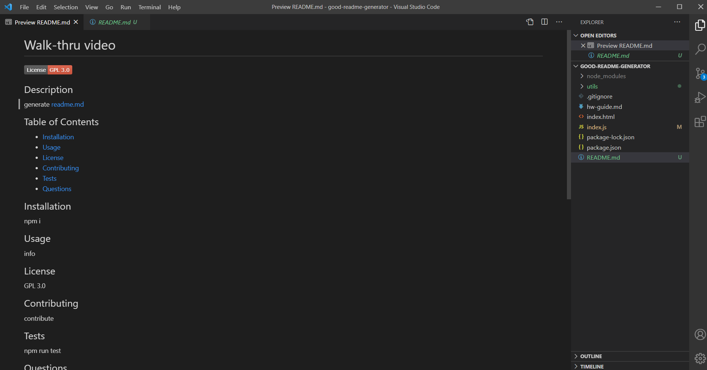

# Good README Generator

## Description

- My motivation for this project was to automate the process of creating a README.md file for a user via a series of questions to the command-line.

- I built this project because as a student of web development this command-line application will serve as a tool for me (and others) when I deploy new applications.

- This command-line application solves the problem of bad README.md files. By asking all the necessary questions and relaying that info to a dynamically generated README.md file, it will be easier for other developers to contribute to my application.

- This project taught me what components make up a good README.md file and it also taught me the concept of automation in programming.

### Walk-thru video link

[Click Here to Watch](https://drive.google.com/file/d/189dHOhESEG0Et2VydUoQiud2HvsqFhT6/view)

The following image demonstrates the command-line application's result:

